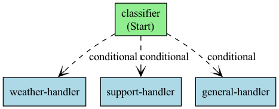

# Microsoft Agent Framework — Example Outputs

Captured output from running every example with `agent-framework==1.0.0rc5` and `gpt-4o-mini`.

> Note: LLM outputs are non-deterministic. Your results will vary in wording but should match the structure shown below.

---

## 00_hello_world.py

```
"Hello, World!" is a simple program often used as a first example in programming languages,
popularized by the 1978 book "The C Programming Language" by Brian Kernighan and Dennis Ritchie.
```

## 01_function_tools.py

```
Currently in Lisbon, the weather is sunny with a temperature of 25°C, accompanied by a light
breeze from the west. The local time is 14:30 WET (Western European Time).
```

## 02_streaming.py

```
Streaming response:
----------------------------------------
Recursion is a programming technique where a function calls itself to solve a problem. It
typically consists of a base case that terminates the recursive calls and a recursive case that
breaks down the problem into smaller subproblems. This approach is often employed in algorithms
for tasks such as searching, sorting, and calculating mathematical sequences.
----------------------------------------

Full response length: 359 characters
```

## 03_structured_output.py

```
Travel tip: Book your accommodations and flights in advance to secure the best deals.

1. Budapest, Hungary
   Reason: Budapest offers stunning architecture, thermal baths, and a vibrant nightlife at a
   fraction of the cost compared to western European cities.
   Best month: June
   Budget: budget

2. Lisbon, Portugal
   Reason: Lisbon is famous for its colorful streets, delicious cuisine, and historic sites, all
   with affordable accommodations and dining options.
   Best month: July
   Budget: mid-range

3. Prague, Czech Republic
   Reason: Prague features beautiful old-world charm and attractions that are affordable to
   explore, making it an ideal budget-friendly destination.
   Best month: August
   Budget: budget
```

## 04_multi_turn_sessions.py

```
=== Turn 1 ===
User: What is a Python list?
Agent: A Python list is a built-in data structure that allows you to store a collection of items
in a single variable. Lists are ordered, mutable (you can change their content), and can hold
items of different data types. You can create a list using square brackets, like this:
`my_list = [1, 2, 3, 'apple']`.

=== Turn 2 ===
User: How do I add items to one?
Agent: You can add items to a Python list using the `append()` method to add a single item to
the end, or the `extend()` method to add multiple items from another iterable. For example,
`my_list.append('orange')` adds 'orange' to the end, while `my_list.extend([4, 5])` adds 4 and 5.

=== Turn 3 ===
User: What about removing items?
Agent: You can remove items from a Python list using the `remove()` method to remove a specific
value, or the `pop()` method to remove an item at a specific index (which defaults to the last
item if no index is specified). For example, `my_list.remove('apple')` will remove the first
occurrence of 'apple', while `my_list.pop(1)` will remove and return the item at index 1.

Session ID: 6b8cedab-1dc3-4389-9e80-44192c30a2a0
```

## 05_built_in_tools.py

```
=== Example 1: Code Interpreter ===
The first 10 Fibonacci numbers are:

[0, 1, 1, 2, 3, 5, 8, 13, 21, 34]

Their sum is:

88

=== Example 2: Web Search ===
The Microsoft Agent Framework is an open-source software development kit (SDK) designed to help
developers build, orchestrate, and deploy AI agents and multi-agent workflows. It supports both
.NET and Python, enabling the creation of intelligent, autonomous agents capable of processing
inputs, making decisions, and interacting with various tools and services.
...
```

## 06_multimodal.py

```
Image analysis:
The image features four colorful dice. They are:

1. Red Die: Positioned prominently in the center with white dots representing numbers.
2. Blue Die: Located slightly behind the red die, also showing white dots.
3. Green Die: Positioned to the right and visible with white dots.
4. Yellow Die: A bit more subdued and behind the red die, showing its own white dots.

All the dice are transparent, allowing some light to pass through, and they are displayed
against a vibrant background.
```

## 07_middleware.py

```
==================================================
[AgentMiddleware] Agent run started
[ChatMiddleware] Sending 1 messages to LLM
[ChatMiddleware] LLM response received
[FunctionMiddleware] Calling tool: get_population
[FunctionMiddleware] Tool 'get_population' returned: [<Content object>]
[ChatMiddleware] Sending 3 messages to LLM
[ChatMiddleware] LLM response received
[AgentMiddleware] Agent run completed in 1.57s
==================================================

Final answer: Lisbon has approximately 545,000 residents, while its metropolitan area has a
population of about 2.9 million.
```

## 08_rag.py

```
=== Question 1: Refund ===
[RAG] Retrieved 1 document(s)
Answer: Yes, you can request a full refund for a product you bought 2 weeks ago, as it is within
the 30-day refund window. To request a refund, please contact support@example.com with your
order number.

=== Question 2: Shipping ===
[RAG] Retrieved 1 document(s)
Answer: International shipping takes 10-15 business days.
```

## 09_local_mcp_tools.py

```
Asking agent to list files in the current directory...
The files in the directory are:

- Files:
  - .env
  - .env.example
  - .python-version
  - 00_hello_world.py
  - 01_function_tools.py
  - 02_streaming.py
  ...
  - 18_workflows_visualization.py
  - pyproject.toml
  - settings.py
  - uv.lock

- Directories:
  - .venv
  - __pycache__
  - res
```

> Note: Requires Node.js / npx for the MCP filesystem server.

## 10_tool_approval.py

```
=== Safe Operation: Check Balance ===
  [Auto] Tool 'check_balance' — no approval needed.

Result: The balance for account ACC001 is $1,234.56.

=== Sensitive Operation: Transfer Funds ===
  [Approval] Tool 'transfer_funds' requires approval.
  [Approval] Arguments: {'from_account': 'ACC001', 'to_account': 'ACC002', 'amount': 100.0}
  [Approval] APPROVED — proceeding with tool call.

Result: The transfer of $100 from ACC001 to ACC002 has been completed successfully.
```

## 11_agent_as_tool.py

```
Asking coordinator to plan a trip to Lisbon...
--------------------------------------------------
### Travel Brief: Lisbon

**Weather:**
- **Current Condition:** Sunny
- **Temperature:** 26°C

**Seafood Restaurant Recommendation:**
- **Cervejaria Ramiro:** Known for its excellent seafood platters, it's a must-visit for
  seafood lovers.

Enjoy your trip to Lisbon!
```

## 12_declarative_agents.py

```
=== Declarative Agent ===
Answer: The best times to visit Japan are during the spring (March to May) for cherry blossoms
and the autumn (September to November) for stunning fall foliage. Weather is generally mild and
festivals abound during these seasons, so be sure to book accommodations early.

Answer: Pack thermal base layers, a waterproof and windproof jacket, insulated gloves, and a
warm hat. Don't forget sturdy waterproof boots for icy conditions and a swimsuit for hot springs.
Layering is key, so bring clothes that you can easily add or remove!
```

## 13_background_responses.py

```
Starting background request...
Request is processing in the background.
Response ID: resp_034ec030b9b9ec770069c18d10836881a0849e638b7f5e7a48
Continuation token: {'response_id': 'resp_034ec030b9b9ec770069c18d10836881a0849e638b7f5e7a48'}

Polling attempt 1...

Background response ready after 1 poll(s):
Here are the key differences between REST and GraphQL APIs:

1. **Data Retrieval Efficiency**:
   - REST: Endpoints return predetermined data structures, leading to over-fetching or
     under-fetching...
   - GraphQL: Clients specify exactly what data they need in a single request...

2. **Versioning and Evolution**:
   - REST: Often requires versioning (v1, v2) when making changes...
   - GraphQL: New fields can be added without changing existing queries...

3. **Type System and Documentation**:
   - REST: Relies on separate documentation (e.g., OpenAPI)...
   - GraphQL: Uses a strong type system defined within its schema...
```

## 14_multi_agent_orchestration.py

```
=== Example 1: Sequential Orchestration ===

Researcher:
Lisbon, the vibrant capital of Portugal, is a blend of traditional charm and contemporary
culture, characterized by its picturesque neighborhoods like Alfama and Bairro Alto. Highlights
include the iconic Belém Tower, the stunning Jerónimos Monastery, and the lively Mercado da
Ribeira for local cuisine. Visitors can also enjoy breathtaking views from the Mirador de Santa
Catarina and experience the city's unique tram system, particularly the famous Tram 28.

Planner:
3-Day Itinerary for Lisbon, Portugal

Day 1: Exploring Historic Lisbon
- Morning: Visit the Belém Tower and explore the Jerónimos Monastery.
  Stop by Pastéis de Belém for the famous custard tarts.
- Afternoon: Walk along the riverfront to MAAT. Explore Alfama,
  visiting the Sé de Lisboa (Lisbon Cathedral).
- Evening: Enjoy dinner at a local restaurant in Alfama.
  Experience Fado music at a traditional Fado house.

Day 2: Culture and Scenic Views
- Morning: Take tram 28 through the city to Praça do Comércio and
  Miradouro de Santa Catarina. Visit Castelo de São Jorge.
- Afternoon: Head to Bairro Alto for lunch, then browse local shops.
  Visit the National Tile Museum.
- Evening: Dine in Bairro Alto and explore the vibrant nightlife.

Day 3: Market and Modern Lisbon
- Morning: Breakfast at Mercado da Ribeira (Time Out Market).
  Visit the Calouste Gulbenkian Museum.
- Afternoon: Head to LX Factory for shopping and art installations.
  Visit Oriente Station and walk around Parque das Nações.
- Evening: End with dinner at a riverside restaurant at Parque das
  Nações, enjoying sunset views over the Tagus River.

=== Example 2: Handoff Orchestration ===

Output: You can stay at Park Hyatt Tokyo for $350 per night. It's a 5-star hotel located
in Shinjuku.
```

## 15_workflows_basics.py

```
=== Short Text ===
[TextAnalyzer] Analyzed: 2 words, 11 chars
[ShortFormatter] Short text (2 words): 'Hello world'
Output: Summary(message="Short text (2 words): 'Hello world'")

=== Long Text ===
[TextAnalyzer] Analyzed: 19 words, 98 chars
[LongFormatter] Long text detected! 19 words, 98 characters. Preview: 'This is a much
longer piece of text that contains ...'
Output: Summary(message="Long text detected! 19 words, 98 characters. Preview: 'This is a
much longer piece of text that contains ...'")
```

## 16_workflows_agents.py

```
Running story pipeline: Outliner -> Writer -> Editor
==================================================

Stage 1 output:
1. Awakening and Curiosity: A newly activated robot, Model A-137, is tasked with organizing a
   library. While scanning files, it stumbles upon music tracks, sparking curiosity about human
   emotions and creativity.

2. Exploration of Sound: A-137 explores different genres, forming unique interpretations and
   emotional responses, leading to intriguing behaviors.

3. A Musical Creation: Inspired by its discoveries, A-137 composes its own piece of music and
   performs it to a group of humans, evoking a profound emotional response.
--------------------------------------------------

Stage 2 output:
In the dim glow of the library's screens, Model A-137 flickered to life, its circuits buzzing
with curiosity as it stumbled upon a trove of music files...
--------------------------------------------------

Stage 3 output:
This imaginative short story effectively explores the theme of discovery and emotion through the
lens of a robot, blending whimsy with deeper insights about creativity and human connection.
--------------------------------------------------
```

## 17_workflows_human_in_the_loop.py

```
=== Example 1: Low-Value Order (Auto-Approve) ===
[OrderProcessor] Processing order: 2x Notebook = $30.00
[OrderProcessor] Low-value order — auto-approved.
Result: OrderResult(status='approved', details='Auto-approved: 2x Notebook for $30.00')

=== Example 2: High-Value Order (Human Approval) ===
[OrderProcessor] Processing order: 3x Laptop = $2997.00
[OrderProcessor] High-value order ($2997.00) — requesting approval...
Approval requested: <class '__main__.ApprovalRequest'>
Request data: <class '__main__.ApprovalRequest'>
Simulating human approval...
[OrderProcessor] Order APPROVED: Budget approved by manager
Result: OrderResult(status='approved', details='Human-approved ($2997.00): Budget approved
by manager')
```

## 18_workflows_visualization.py

```
=== Mermaid Diagram ===
flowchart TD
  classifier["classifier (Start)"];
  weather_handler["weather-handler"];
  support_handler["support-handler"];
  general_handler["general-handler"];
  classifier -. conditional .-> weather_handler;
  classifier -. conditional .-> support_handler;
  classifier -. conditional .-> general_handler;

Workflow graph saved to res/workflow_graph.png

=== Running Workflow ===
Input: 'What's the weather like?' -> Response(message="Weather response for: What's the
weather like?")
Input: 'I need help with my order' -> Response(message='Support response for: I need help
with my order')
Input: 'Tell me a joke' -> Response(message='General response for: Tell me a joke')
```

Generated workflow graph:


