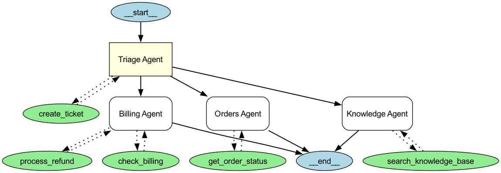

# OpenAI Agents SDK — Example Outputs

All examples run with `openai-agents>=0.14.2`, `openai>=2.0.0`, model `gpt-4o-mini`.

---

## 0. Hello World (`00_hello_world.py`)

```
A function calls self,
Infinite loops in silence,
Echoes through code's depths.
```

---

## 1. Tools and Metrics (`01_tools_and_metrics.py`)

```
[debug] get_weather called
--------------------------------------------------
Final response:
	The weather in Tokyo is currently sunny with a temperature range of
	14-20°C, along with some wind.
--------------------------------------------------
Internal messages:
	ToolCallItem(... name='get_weather' arguments='{"city":"Tokyo"}' ...)
	ToolCallOutputItem(... output=Weather(city='Tokyo',
	    temperature_range='14-20C', conditions='Sunny with wind.') ...)
	MessageOutputItem(... text='The weather in Tokyo is currently sunny
	    with a temperature range of 14-20°C, along with some wind.' ...)
--------------------------------------------------
Metrics:
	Usage(requests=1, input_tokens=55, output_tokens=15, total_tokens=70)
	Usage(requests=1, input_tokens=96, output_tokens=25, total_tokens=121)
--------------------------------------------------
```

---

## 2. Structured Outputs (`02_structured_outputs.py`)

```
[debug] get_user_profile called
Internal messages:
	ToolCallItem(... name='get_user_profile' arguments='{"id":1}' ...)
	ToolCallOutputItem(... output=UserProfile(id=1, name='Martim Santos',
	    age=24, location='Lisbon, Portugal',
	    iban='DE89370400440532013000') ...)
	MessageOutputItem(... text='{"name":"Martim Santos","age":24}' ...)
--------------------------------------------------
Final response:
	name='Martim Santos' age=24
```

> The agent fetched the full user profile (including IBAN), but the structured output
> type `FilteredUserProfile` only includes `name` and `age` — sensitive fields are
> automatically excluded.

---

## 3. Parallelization in Workflow (`03_parallelization_in_workflow.py`)

**Input:** `The sun rises over the mountains`

```
Translations:

El sol sale sobre las montañas.

El sol sale sobre las montañas.

-----
Best translation: The best Spanish translation is:

El sol sale sobre las montañas.
```

---

## 4. Handoffs and Streaming (`04_handoffs_and_streaming.py`)

**Input:** `Hello, can you speak Portuguese?` then `exit`

```
Hi! We speak French, Portuguese and English. How can I help?
Olá! Sim, eu falo português. Como posso ajudar você hoje?

Enter a message: Exiting...
```

> The orchestrator handed off to `portuguese_agent` and the response was streamed
> token-by-token using `ResponseTextDeltaEvent`.

---

## 5. Agents as Tools (`05_agents_as_tools.py`)

**Input:** `Translate 'hello world' to Spanish, French, and Italian`

```
  - Translation step: Here are the translations:

- Spanish: hola mundo
- French: Bonjour le monde.
- Italian: Ciao mondo!


Final response:
Here are the translations for "hello world":

- Spanish: hola mundo
- French: Bonjour le monde.
- Italian: Ciao mondo!
```

> The orchestrator called each translation agent as a tool, then the synthesizer
> combined and verified the results.

---

## 6. Output Guardrails (`06_output_guardrails.py`)

```
First message passed - guardrail didn't trip as expected.
Guardrail tripped. Info: {'phone_number_in_response': False,
    'phone_number_in_reasoning': True}
```

> First request (no phone number) passes. Second request triggers the guardrail
> because the agent's reasoning contains a phone number with "650" area code.

---

## 7. LLM as a Judge (`07_llm_as_a_judge.py`)

**Input:** `A detective story in a futuristic city`

```
Story outline generated
Evaluator score: needs_improvement
Re-running with feedback
Story outline generated
Evaluator score: needs_improvement
Re-running with feedback
Story outline generated
Evaluator score: needs_improvement
Re-running with feedback
Story outline generated
Evaluator score: needs_improvement
Re-running with feedback
Story outline generated
Evaluator score: pass
Story outline is good enough, exiting.
Final story outline:

## Comprehensive Story Outline: "Echoes of Tomorrow"

### Setting:
- A vibrant yet dystopian metropolis in 2145, marked by dazzling neon lights,
  towering skyscrapers, and a heavy presence of surveillance drones...

### Main Character:
- Detective Lena Korr: Once a dedicated police officer, Lena's life unraveled
  after her sister Cassie disappeared while investigating NeuroTech...

### Conflict:
- A string of disappearances links back to NeuroTech's mind-control experiments...

### Plot Points:
1. Inciting Incident: Lena investigates Jack Whitmore's disappearance...
2. Rising Action: Discovery of Cassie's connection, red herrings, false allies...
3. Climax: Confrontation with CEO Elena Voss at a corporate gala...
4. Falling Action: Escape from NeuroTech facility, alliances formed...
5. Resolution: Evidence leaked, NeuroTech exposed, Lena rebuilds trust...

### Themes:
- Corporate power vs individual agency
- Truth as personal and communal journey
- Transformation from isolation to connection
```

> The story writer agent iteratively refined its outline based on the evaluator
> agent's feedback until it scored `pass` (took 5 iterations).

---

## 8. Tracing (`08_tracing.py`)

```
Joke: Sure! Why did the scarecrow win an award?

Because he was outstanding in his field!
Rating: That's a classic! I'd rate it a solid 8 out of 10 for its clever
wordplay and pun. It's simple, light-hearted, and definitely puts a smile
on your face.
```

> Two `Runner.run` calls wrapped in a single `trace("8_tracing")` block. Both
> LLM calls appear as spans in one trace on https://platform.openai.com/traces.

---

## 9. Sessions (`09_sessions.py`)

```
=== Sessions Example ===
The agent will remember previous messages automatically.

--- Turn 1 ---
User: What city is the Golden Gate Bridge in?
Assistant: San Francisco.

--- Turn 2 ---
User: What state is it in?
Assistant: California.

--- Turn 3 ---
User: What's the population of that state?
Assistant: As of 2023, California's population is approximately 39 million.

=== Session now holds 6 items ===
Popped last item (assistant response)
Session now holds 5 items after pop

=== Sessions Demo Complete ===
Notice how the agent remembered context from previous turns!
Sessions automatically handles conversation history persistence.
```

> The agent correctly resolved "it" (Turn 2) and "that state" (Turn 3) using
> session memory stored in SQLite. The `pop_item` and `get_items` APIs are
> also demonstrated.

---

## 10. Human-in-the-Loop (`10_human_in_the_loop.py`)

**Piped input:** `y` for both approval prompts.

```
=== Human-in-the-Loop Example ===

--- Scenario 1: Delete account (always needs approval) ---
User: Delete the account for user_42 right now using the delete_user_account tool.

Run paused with 1 pending approval(s)
State serialized (8671 chars) — could persist to DB

==================================================
  APPROVAL REQUIRED
  Tool: delete_user_account
  Arguments: {"user_id":"user_42"}
==================================================
  Approve? [y/N]:
Agent: The account for user_42 has been permanently deleted.

--- Scenario 2: Small refund (no approval needed, amount <= $100) ---
User: Process a $50 refund for order ORD-123

(No approval needed — amount is under $100)
Agent: The $50 refund for order ORD-123 has been successfully processed.

--- Scenario 3: Large refund (needs approval, amount > $100) ---
User: Process a $250 refund for order ORD-456

==================================================
  APPROVAL REQUIRED
  Tool: process_refund
  Arguments: {"order_id":"ORD-456","amount":250}
==================================================
  Approve? [y/N]:
Agent: The refund of $250.00 has been successfully processed for order ORD-456.

=== Human-in-the-Loop Demo Complete ===
```

> Scenario 1: `needs_approval=True` always pauses. State is serialized/deserialized.
> Scenario 2: `needs_approval` callback returns `False` for $50 (under $100 threshold).
> Scenario 3: `needs_approval` callback returns `True` for $250 (over $100 threshold).

---

## 11. MCP Tools (`11_mcp_tools.py`)

```
=== MCP Tools Example ===

--- Basic MCP query ---
User: What programming language is the openai-agents-python repo written in?

A: The openai-agents-python repository is written in Python.

--- Streaming MCP query ---
User: What are the main features of the OpenAI Agents SDK?

A: The OpenAI Agents SDK offers several key features:

1. Agent Configuration: Easily define agents with properties such as name,
   instructions, model type, and tools they can use.
2. Context Management: Supports dependency injection for state management.
3. Output Types: Configurable output formats including plain text and
   structured outputs (Pydantic objects).
4. Real-Time Capabilities: Session management, audio processing, and
   handoff functionalities.
5. Tracing and Monitoring: Built-in support for tracking agent activities.
6. Extensibility: Integration with external tools and custom LLMs.
7. Comprehensive Examples: Variety of example implementations demonstrating
   different agent patterns.

--- MCP with approval flow ---
User: How many examples are in the repository?

A: The repository contains a total of 231 files that are related to examples.

=== MCP Tools Demo Complete ===
HostedMCPTool lets you connect to any MCP server without local setup!
```

> Uses `HostedMCPTool` with gitmcp.io to query the OpenAI Agents SDK repo docs
> via MCP, with streaming output using `ResponseTextDeltaEvent` and approval flow.

---

## 12. Realtime Agent (`12_realtime_agent.py`)

```
=== Realtime Agent Example ===

Starting realtime session via WebSocket...
(Using text messages for this demo — voice uses send_audio())

User: What's the weather in San Francisco?

A: [calling get_weather({
  "city": "San Francisco"
}
)]
[tool result: 62°F, foggy]
Right now in San Francisco, it's about 62 degrees Fahrenheit and foggy.

=== Realtime Agent Demo Complete ===
In production, connect microphone input and speaker output
for a full voice conversation experience.
```

> The realtime agent connects via WebSocket, receives a text message, calls the
> `get_weather` tool, and produces a transcript. In production, this would use
> microphone/speaker for a full voice experience.

---

## 13. Agent Visualization (`13_agent_visualization.py`)

```
=== Agent Visualization Example ===

Generating agent architecture graph...

Graph generated! Node legend:
  - Yellow boxes   = Agents
  - Green ellipses = Tools
  - Solid arrows   = Handoffs (agent -> agent)
  - Dotted arrows  = Tool connections

Graph saved to res/agent_graph.png

Agent Architecture:
  Triage Agent
    Tools: create_ticket
    Handoffs:
      -> Knowledge Agent (tools: search_knowledge_base)
      -> Billing Agent (tools: check_billing, process_refund)
      -> Orders Agent (tools: get_order_status)

=== Agent Visualization Demo Complete ===
Open res/agent_graph.png to see the visual graph!
```

> Uses `draw_graph()` from `agents[viz]` to render the multi-agent architecture
> as a PNG file showing agents (yellow), tools (green), handoffs (solid arrows),
> and tool connections (dotted arrows).



---

## 14. Voice Agent (`14_voice_agent.py`)

```
Voice Pipeline created
  Workflow: SingleAgentVoiceWorkflow
  Agent: VoiceAssistant
  Model: gpt-4o-mini

Audio input: 3s of silence at 24000Hz
Running pipeline (STT → Agent → TTS)...

  [lifecycle] turn_started
  [lifecycle] turn_ended
  [lifecycle] session_ended

Pipeline complete!
  Audio chunks received: 7
  Total audio bytes: 391200
  Lifecycle events: ['turn_started', 'turn_ended', 'session_ended']
```

> Demonstrates the `VoicePipeline` (STT → Agent → TTS) with `SingleAgentVoiceWorkflow`.
> Sends 3 seconds of silence as input and collects streamed audio output events
> without requiring audio hardware. In production, feed real microphone data and
> play back audio chunks via `sounddevice`.
