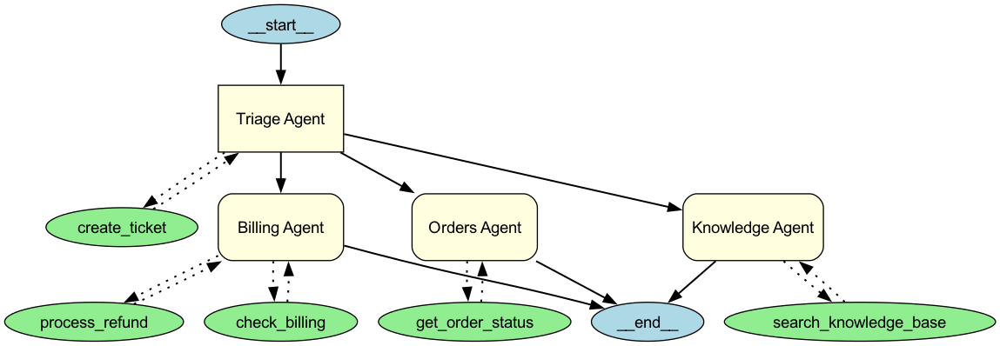

# OpenAI Agents SDK — Example Outputs

All examples run with `openai-agents>=0.22.2`, `openai>=3.13.0`, model `gpt-4o-mini`
(`15_sandbox_agent.py` and `17_programmatic_tool_calling.py` require `gpt-5.6`).

---

## 0. Hello World (`00_hello_world.py`)

```
Code calls itself back,
Layers deep, each loop unfolds—
Endless paths explore.

model_settings dict coerced to ModelSettings(temperature=0.2)
```

> Since 0.19.0, SDK config objects can be passed as plain dicts — the `model_settings`
> dict is coerced into a `ModelSettings` instance at the constructor boundary.

---

## 1. Tools and Metrics (`01_tools_and_metrics.py`)

```
[debug] get_weather called
--------------------------------------------------
Final response:
	The weather in Tokyo is currently sunny with a temperature range of
	14-20°C, along with some wind.
--------------------------------------------------
Internal messages:
	ToolCallItem(... name='get_weather' arguments='{"city":"Tokyo"}' ...)
	ToolCallOutputItem(... output=Weather(city='Tokyo',
	    temperature_range='14-20C', conditions='Sunny with wind.') ...)
	MessageOutputItem(... text='The weather in Tokyo is currently sunny
	    with a temperature range of 14-20°C, along with some wind.' ...)
--------------------------------------------------
Metrics:
	Usage(requests=1, input_tokens=55, output_tokens=15, total_tokens=70)
	Usage(requests=1, input_tokens=96, output_tokens=25, total_tokens=121)
--------------------------------------------------
```

---

## 2. Structured Outputs (`02_structured_outputs.py`)

```
[debug] get_user_profile called
Internal messages:
	ToolCallItem(... name='get_user_profile' arguments='{"id":1}' ...)
	ToolCallOutputItem(... output=UserProfile(id=1, name='Martim Santos',
	    age=24, location='Lisbon, Portugal',
	    iban='DE89370400440532013000') ...)
	MessageOutputItem(... text='{"name":"Martim Santos","age":24}' ...)
--------------------------------------------------
Final response:
	name='Martim Santos' age=24
```

> The agent fetched the full user profile (including IBAN), but the structured output
> type `FilteredUserProfile` only includes `name` and `age` — sensitive fields are
> automatically excluded.

---

## 3. Parallelization in Workflow (`03_parallelization_in_workflow.py`)

**Input:** `The sun rises over the mountains`

```
Translations:

El sol sale sobre las montañas.

El sol sale sobre las montañas.

-----
Best translation: The best Spanish translation is:

El sol sale sobre las montañas.
```

---

## 4. Handoffs and Streaming (`04_handoffs_and_streaming.py`)

**Input:** `Hello, can you speak Portuguese?` then `exit`

```
Hi! We speak French, Portuguese and English. How can I help?
Olá! Sim, eu falo português. Como posso ajudar você hoje?

Enter a message: Exiting...
```

> The orchestrator handed off to `portuguese_agent` and the response was streamed
> token-by-token using `ResponseTextDeltaEvent`.

---

## 5. Agents as Tools (`05_agents_as_tools.py`)

**Input:** `Translate 'hello world' to Spanish, French, and Italian`

```
  - Translation step: Here are the translations:

- Spanish: **hola mundo**
- French: **Bonjour le monde**
- Italian: **Ciao mondo!**


Final response:
Final translations:

- Spanish: **hola mundo**
- French: **Bonjour le monde**
- Italian: **Ciao mondo!**
```

> The orchestrator called each translation agent as a tool, then the synthesizer
> combined and verified the results. The run also sets
> `RunConfig(tool_name_collision_policy="error")` (0.19.3), which turns a duplicate
> tool name into a `UserError` instead of the default warning — the three tool names
> here are distinct, so it stays silent.

---

## 6. Output Guardrails (`06_output_guardrails.py`)

```
First message passed - guardrail didn't trip as expected.
Guardrail tripped. Info: {'phone_number_in_response': False,
    'phone_number_in_reasoning': True}
```

> First request (no phone number) passes. Second request triggers the guardrail
> because the agent's reasoning contains a phone number with "650" area code.

---

## 7. LLM as a Judge (`07_llm_as_a_judge.py`)

**Input:** `A detective story in a futuristic city`

```
Story outline generated
Evaluator score: needs_improvement
Re-running with feedback
Story outline generated
Evaluator score: needs_improvement
Re-running with feedback
Story outline generated
Evaluator score: needs_improvement
Re-running with feedback
Story outline generated
Evaluator score: needs_improvement
Re-running with feedback
Story outline generated
Evaluator score: pass
Story outline is good enough, exiting.
Final story outline:

## Comprehensive Story Outline: "Echoes of Tomorrow"

### Setting:
- A vibrant yet dystopian metropolis in 2145, marked by dazzling neon lights,
  towering skyscrapers, and a heavy presence of surveillance drones...

### Main Character:
- Detective Lena Korr: Once a dedicated police officer, Lena's life unraveled
  after her sister Cassie disappeared while investigating NeuroTech...

### Conflict:
- A string of disappearances links back to NeuroTech's mind-control experiments...

### Plot Points:
1. Inciting Incident: Lena investigates Jack Whitmore's disappearance...
2. Rising Action: Discovery of Cassie's connection, red herrings, false allies...
3. Climax: Confrontation with CEO Elena Voss at a corporate gala...
4. Falling Action: Escape from NeuroTech facility, alliances formed...
5. Resolution: Evidence leaked, NeuroTech exposed, Lena rebuilds trust...

### Themes:
- Corporate power vs individual agency
- Truth as personal and communal journey
- Transformation from isolation to connection
```

> The story writer agent iteratively refined its outline based on the evaluator
> agent's feedback until it scored `pass` (took 5 iterations).

---

## 8. Tracing (`08_tracing.py`)

```
Joke: Why did the scarecrow win an award?

Because he was outstanding in his field!
Rating: That's a classic! I'd give it an 8 out of 10 for its clever wordplay
and lighthearted charm. Scarecrow jokes always get a laugh! Got any more?
(second run traced without task/turn spans)
```

> Two `Runner.run` calls wrapped in a single `trace("8_tracing")` block. Both
> LLM calls appear as spans in one trace on https://platform.openai.com/traces.
> The second run passes `RunConfig(tracing={"include_task_and_turn_spans": False})`
> (0.18.3), which suppresses the automatic task/turn spans while still recording
> the LLM span.

---

## 9. Sessions (`09_sessions.py`)

```
=== Sessions Example ===
The agent will remember previous messages automatically.

--- Turn 1 ---
User: What city is the Golden Gate Bridge in?
Assistant: San Francisco.

--- Turn 2 ---
User: What state is it in?
Assistant: California.

--- Turn 3 ---
User: What's the population of that state?
Assistant: As of 2023, California's population is approximately 39 million.

=== Session now holds 6 items ===
Popped last item (assistant response)
Session now holds 5 items after pop

=== Sessions Demo Complete ===
Notice how the agent remembered context from previous turns!
Sessions automatically handles conversation history persistence.
```

> The agent correctly resolved "it" (Turn 2) and "that state" (Turn 3) using
> session memory stored in SQLite. The `pop_item` and `get_items` APIs are
> also demonstrated.

---

## 10. Human-in-the-Loop (`10_human_in_the_loop.py`)

**Piped input:** `y` for both approval prompts.

```
=== Human-in-the-Loop Example ===

--- Scenario 1: Delete account (always needs approval) ---
User: Delete the account for user_42 right now using the delete_user_account tool.

Run paused with 1 pending approval(s)
State serialized (8671 chars) — could persist to DB

==================================================
  APPROVAL REQUIRED
  Tool: delete_user_account
  Arguments: {"user_id":"user_42"}
==================================================
  Approve? [y/N]:
Agent: The account for user_42 has been permanently deleted.

--- Scenario 2: Small refund (no approval needed, amount <= $100) ---
User: Process a $50 refund for order ORD-123

(No approval needed — amount is under $100)
Agent: The $50 refund for order ORD-123 has been successfully processed.

--- Scenario 3: Large refund (needs approval, amount > $100) ---
User: Process a $250 refund for order ORD-456

==================================================
  APPROVAL REQUIRED
  Tool: process_refund
  Arguments: {"order_id":"ORD-456","amount":250}
==================================================
  Approve? [y/N]:
Agent: The refund of $250.00 has been successfully processed for order ORD-456.

=== Human-in-the-Loop Demo Complete ===
```

> Scenario 1: `needs_approval=True` always pauses. State is serialized/deserialized.
> Scenario 2: `needs_approval` callback returns `False` for $50 (under $100 threshold).
> Scenario 3: `needs_approval` callback returns `True` for $250 (over $100 threshold).

---

## 11. MCP Tools (`11_mcp_tools.py`)

```
=== MCP Tools Example ===

--- Basic MCP query ---
User: What programming language is the openai-agents-python repo written in?

A: The openai-agents-python repository is written in Python.

--- Streaming MCP query ---
User: What are the main features of the OpenAI Agents SDK?

A: The OpenAI Agents SDK offers several key features:

1. Agent Configuration: Easily define agents with properties such as name,
   instructions, model type, and tools they can use.
2. Context Management: Supports dependency injection for state management.
3. Output Types: Configurable output formats including plain text and
   structured outputs (Pydantic objects).
4. Real-Time Capabilities: Session management, audio processing, and
   handoff functionalities.
5. Tracing and Monitoring: Built-in support for tracking agent activities.
6. Extensibility: Integration with external tools and custom LLMs.
7. Comprehensive Examples: Variety of example implementations demonstrating
   different agent patterns.

--- MCP with approval flow ---
User: How many examples are in the repository?

A: The repository contains a total of 231 files that are related to examples.

=== MCP Tools Demo Complete ===
HostedMCPTool lets you connect to any MCP server without local setup!
```

> Uses `HostedMCPTool` with gitmcp.io to query the OpenAI Agents SDK repo docs
> via MCP, with streaming output using `ResponseTextDeltaEvent` and approval flow.

---

## 12. Realtime Agent (`12_realtime_agent.py`)

```
=== Realtime Agent Example ===

Default realtime model: gpt-realtime-2.1

Starting realtime session via WebSocket...
(Using text messages for this demo — voice uses send_audio())

User: What's the weather in San Francisco?

Assistant: Let me check the latest conditions for San Francisco so I can tell
you what it's like right now.
[calling get_weather({"city":"San Francisco"})]
[tool result: 62°F, foggy]
Assistant: It's 62 degrees and foggy in San Francisco. Classic foggy
vibe—light jacket weather for sure.

=== Realtime Agent Demo Complete ===
In production, connect microphone input and speaker output
for a full voice conversation experience.
```

> The example no longer pins `gpt-4o-mini-realtime-preview`, so it now runs on
> `DEFAULT_REALTIME_MODEL`, which became `gpt-realtime-2.1` in 0.18.0. That model
> speaks once before calling the tool, so the event loop keeps reading until the
> transcript that follows the tool result.

---

## 13. Agent Visualization (`13_agent_visualization.py`)

```
=== Agent Visualization Example ===

Generating agent architecture graph...

Graph generated! Node legend:
  - Yellow boxes   = Agents
  - Green ellipses = Tools
  - Solid arrows   = Handoffs (agent -> agent)
  - Dotted arrows  = Tool connections

Graph saved to res/agent_graph.png

Agent Architecture:
  Triage Agent
    Tools: create_ticket
    Handoffs:
      -> Knowledge Agent (tools: search_knowledge_base)
      -> Billing Agent (tools: check_billing, process_refund)
      -> Orders Agent (tools: get_order_status)

=== Agent Visualization Demo Complete ===
Open res/agent_graph.png to see the visual graph!
```

> Uses `draw_graph()` from `agents[viz]` to render the multi-agent architecture
> as a PNG file showing agents (yellow), tools (green), handoffs (solid arrows),
> and tool connections (dotted arrows).



---

## 14. Voice Agent (`14_voice_agent.py`)

```
Voice Pipeline created
  Workflow: SingleAgentVoiceWorkflow
  Agent: VoiceAssistant
  Model: gpt-4o-mini

Audio input: 3s of silence at 24000Hz
Running pipeline (STT → Agent → TTS)...

  [lifecycle] turn_started
  [lifecycle] turn_ended
  [lifecycle] session_ended

Pipeline complete!
  Audio chunks received: 7
  Total audio bytes: 391200
  Lifecycle events: ['turn_started', 'turn_ended', 'session_ended']
```

> Demonstrates the `VoicePipeline` (STT → Agent → TTS) with `SingleAgentVoiceWorkflow`.
> Sends 3 seconds of silence as input and collects streamed audio output events
> without requiring audio hardware. In production, feed real microphone data and
> play back audio chunks via `sounddevice`.

---

## 15. Sandbox Agent (`15_sandbox_agent.py`)

```
=== Sandbox Agent Example ===

SandboxAgent configuration:
  Name: Code Reviewer
  Model: gpt-5.6
  Manifest entries: ['hello.py', 'task.md']
  Capabilities: ['filesystem', 'shell', 'compaction']
  Client: UnixLocalSandboxClient

Running the agent in the sandbox...

Sandbox tool activity:
  -> exec_command: cat task.md
     workspace: /var/folders/qm/.../T/sandbox-local-onjvxr5e
  -> exec_command: sed -n '1,240p' hello.py
     workspace: /var/folders/qm/.../T/sandbox-local-onjvxr5e
     Process exited with code 0
     Process exited with code 0

Agent response:
1. Defines greeting helpers and prints `Hello, World!` when run directly.
2. Functions: `greet`, `shout`.

=== Sandbox Agent Demo Complete ===
The files were staged from the Manifest and read with real shell tools.
```

> The previous version of this example could not run at any SDK version (wrong
> import path, `SecretStr` passed where `str` was required, raw strings as Manifest
> entries, and a `SandboxAgent(agent=..., manifest=...)` constructor that does not
> exist). It now stages the Manifest into a real local workspace via
> `UnixLocalSandboxClient` and the model reads the files with the built-in shell
> capability — the `exec_command` lines are the actual commands it ran.
> Requires `gpt-5.6`: `gpt-4o-mini` rejects the sandbox tools with
> `400 Invalid value: 'custom'`.

---

## 16. Tool Input Guardrails (`16_tool_input_guardrails.py`)

```
Allowed case:
Transferred $50.00 to Alice.

Rejected case:
The transfer of $5,000 to Bob has been refused because it exceeds the limit
for automatic transactions. Please let me know if you'd like to transfer a
smaller amount or need assistance with something else.

Blocked case: guardrail tripped.
Info: {'amount': 25000.0, 'decision': 'blocked'}
```

> A tool input guardrail (added in 0.17.6) inspects the arguments before the
> `transfer_money` tool runs. The guardrail returns one of three behaviors via
> `ToolGuardrailFunctionOutput`: `allow()` lets the $50 transfer through,
> `reject_content()` skips the $5,000 transfer and feeds a refusal back to the
> model, and `raise_exception()` halts the run on the $25,000 transfer with a
> `ToolInputGuardrailTripwireTriggered`.

---

## 17. Programmatic Tool Calling (`17_programmatic_tool_calling.py`)

**Model:** `gpt-5.6` (Responses-API-only feature — hardcoded, not `settings.OPENAI_MODEL_NAME`)

```
=== Programmatic Tool Calling Example ===

Generated JavaScript program #1:
------------------------------------------------------------
const skus = ["desk-lamp", "keyboard", "monitor", "office-chair"];
const results = await Promise.all(skus.map(sku => tools.get_inventory({sku})));
results.forEach(text);
------------------------------------------------------------
Program result handed back to the model:
  {"available_units":42,"sku":"desk-lamp"}
  {"available_units":11,"sku":"keyboard"}
  {"available_units":0,"sku":"monitor"}
  {"available_units":3,"sku":"office-chair"}

Generated JavaScript program #2:
------------------------------------------------------------
const monitor = await tools.get_lead_time({sku: "monitor"});
const chair = await tools.get_lead_time({sku: "office-chair"});
text(monitor);
text(chair);
------------------------------------------------------------
Program result handed back to the model:
  {"days":21,"sku":"monitor"}
  {"days":14,"sku":"office-chair"}

Tool calls driven by the program(s) (6):
  - get_inventory(desk-lamp)
  - get_inventory(keyboard)
  - get_inventory(office-chair)
  - get_inventory(monitor)
  - get_lead_time(monitor)
  - get_lead_time(office-chair)

Agent response:
monitor — reorder; arrives in 21 days.
office-chair — reorder; arrives in 14 days.
No other SKUs need reordering.

=== Programmatic Tool Calling Demo Complete ===
6 tool calls ran inside the sandbox across 2 generated program(s) — the loop,
the parallel fan-out and the threshold check cost no model round trips.
```

> The headline feature of 0.19.0. `ProgrammaticToolCallingTool()` plus
> `@tool(allowed_callers=["programmatic"])` and
> `ModelSettings(tool_choice="programmatic_tool_calling")` let the model emit
> JavaScript that runs in a hosted V8 sandbox. Program #1 fanned four inventory
> lookups out with `Promise.all`; program #2 only fetched lead times for the two
> SKUs under the threshold. Six tool calls, no round trip per call.
> Note: a programmatic tool's return annotation must be an object schema
> (Pydantic model, TypedDict or dataclass) — a bare `int` raises `UserError`.

---

## 18. Error Handlers (`18_error_handlers.py`)

```
=== Error Handlers Example ===

--- Scenario 1: max_turns (real model, max_turns=1) ---
  [tool] lookup_order(ORD-77)
  [handler] max_turns  <- MaxTurnsExceeded: Max turns (1) exceeded
  [handler] 2 item(s) produced before the limit
  Final output: I ran out of turns before finishing — ask again to continue.

--- Scenario 2: model_refusal (scripted refusal) ---
  [handler] model_refusal  <- ModelRefusalError: Model refused to produce output: I won't do that.
  Final output: I can't help with that request, but I can answer product questions.

--- Scenario 3: invalid_final_output (scripted prose vs output_type) ---
  [handler] invalid_final_output  <- ModelBehaviorError
  Final output: city='unknown' conditions='unavailable'

=== Error Handlers Demo Complete ===
Every run returned a usable final output — none of them raised.
```

> `Runner.run(error_handlers={...})` turns three failure modes into usable final
> outputs instead of exceptions. `invalid_final_output` was added in 0.17.8,
> joining `max_turns` and `model_refusal`. Scenario 1 uses the real model with
> `max_turns=1`; scenarios 2 and 3 use a small scripted stub `Model` so the
> refusal and the schema mismatch fire deterministically without an API call.
> The fallback returned by `invalid_final_output` must itself satisfy the agent's
> `output_type`, hence the `WeatherReport` instance.

---

## 19. Scripted Model Testing (`19_scripted_model_testing.py`)

```
=== Scripted model testing ===

Final output: It is sunny and 25C in Lisbon.
Tool called with: ['Lisbon']
Assertions passed — and not one network call was made.

UnconsumedModelSteps: 1 scripted model step(s) were not consumed.
```

> `ScriptedModel` replaces the model with a fixed list of steps, so the run is
> deterministic and makes **no network calls at all** — the whole example
> finishes in well under a second. The first agent is scripted to call
> `get_weather` and then answer from its result, which lets the example assert
> on the tool argument and the final text rather than on model wording.
> `assert_complete()` is the second half of the contract: the short agent stops
> after one message, leaving a step unconsumed, which is how a workflow that
> quietly ended early gets caught instead of passing silently.
